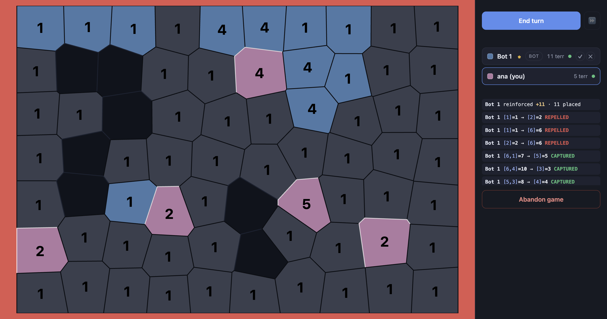

# dicevibe

**Roll dice, take provinces, take everything.**

A multiplayer dice-war game for 2–8 players in the browser. Every board is
generated fresh, you start with five provinces and a handful of dice, and the
last player holding land wins.



---

## Vibecoded, start to finish

dicevibe is fully vibecoded. One prompt wrote the whole thing — the server, the
map generator, the bots, the interface and its test suite — and a few short
follow-up prompts lifted it up afterwards. No part of it was written by hand.

The lift-ups, roughly in the order they came:

- **Alliances.** Pacts you can propose, accept and break, with bots that
  negotiate back and never attack a friend.
- **A board you can read.** Hovering a province fades everyone else's land out,
  and the dice ciphers dropped their badges and went plain black.
- **The turn you are on.** The board's whole surround turns red when the turn
  comes round to you, and stays red until you move the pointer over the map.
- **Skipping the wait.** A ⏩ button that ends a bot's turn immediately instead
  of one beat at a time.
- **Room to breathe.** The End turn row and the players list stopped fighting
  over the same margin.
- **A second bot.** The original policy became v1, a searching one became v2, and
  Add bot now deals one at random — with an arena built to check whether the new
  one is actually any harder to beat. It is: v2 takes 58% of its games against v1.
  That is written up in [The bots](#the-bots) with the runs behind it, because the
  measurement is the point.
- **A third bot, and buttons to pick one.** v3 scores a position by what the
  end-of-turn refill will actually do with it, so it can tell a capture that
  leaves a gap behind from one that leaves the source buried in its own land. The
  four buttons — Random, v1, v2, v3 — replace the single Add bot, so a table can
  be set up deliberately instead of drawn.

---

## Quick start

You need **Node 20.11 or newer** (it uses `import.meta.dirname`) and nothing
else. There is no build step and no database — a game lives in the server's
memory for as long as the process does.

```bash
git clone https://github.com/dnkorbut/dicevibe.git
cd dicevibe
npm install
npm start
```

Then open **http://localhost:8880**.

`npm run dev` runs the same server under `node --watch`, so it restarts when you
edit a file.

Prefer a container? There's a `Dockerfile` and the same server runs in it
unchanged — see [Running in Docker](#running-in-docker) below. Everything else on
this page applies to both.

## Playing with other people

- **Same machine** — open a second browser tab (or a private window) at the same
  address. Each tab is its own seat.
- **Same network** — the server listens on every interface, so anyone on your
  Wi-Fi can join at `http://<your-machine's-ip>:8880`. Use `PORT=8080 npm start`
  if 8880 is taken.
- **Over the internet** — put it behind a tunnel or a port forward. There are no
  accounts and no TLS: plain HTTP, and a game is gone when the process stops.

## Running in Docker

The repo carries a `Dockerfile`, and the game runs in a container with nothing
extra to configure. It works the same under Podman and any other OCI-compatible
runtime — the commands below are the only difference.

```bash
docker build -t dicevibe .
docker run --rm -p 8880:8880 dicevibe
```

Then open **http://localhost:8880**, exactly as if you had run `npm start`.

- **The port.** The container listens on **8880**, the same port `npm start`
  uses, so nothing about the address changes when you containerise it.
  `-p 8080:8880` puts the game on 8080 of your machine. To move the port inside
  the container as well: `docker run --rm -e PORT=8080 -p 8080:8080 dicevibe`.
- **`EXPOSE` publishes nothing.** It is a note to whoever reads the image, and a
  container listening on 8880 can be published on any port you like — `-p` on
  `docker run` is the only thing that decides that.
- **Every other setting is an environment variable**, the same ones as on the
  host: `docker run --rm -e DICEVIBE_BOT_DELAY_MS=0 -p 8880:8880 dicevibe`.
- **Playing with others.** `-p 8880:8880` publishes on every interface, so
  anyone on your network joins at `http://<your-ip>:8880` — the container changes
  nothing about that.
- **Stopping it.** `docker stop` ends the game at once. Rooms live in memory,
  nothing is written to disk, and the server handles SIGTERM rather than making
  you wait out the grace period.
- **What's in the image.** Production dependencies only, no `test/`, no `docs/`
  and no `tools/` — the suite and the arena both run on the host — and running as
  the unprivileged `node` user that `node:24-alpine` already ships. There is no
  build step, no database, and no state to persist.

The tests need the checkout on the host (`npm test`): the image deliberately has
neither the test files nor `socket.io-client` in it.

---

## How to play

A short version of all of this is in the game itself: **How to play** on the
menu, and the **?** in the corner of the board once a game has started.

1. **Name yourself** (optional) and press **Create game**. Pick a map style and a
   size — or leave the size on *Style default*.
2. **Everyone else joins** from the same page: your game appears under *Open
   games*, and one click takes a seat. Up to 8.
3. **The host fills the empty seats with bots** if there aren't enough humans,
   then presses **Start game**. Two players minimum.
4. **On your turn**, click one of your provinces to pick it up. Every province it
   can legally attack lights up — click one of those to attack it. Click the same
   province again to put it down.
5. **Press End turn** when you're done. You can attack as many times as you like
   in a turn, in any order.
6. **The red frame** around the board means the turn is yours and you haven't
   looked at the map yet. Move the pointer over it and the frame goes.
7. **⏩** ends the current bot's turn right now, if a bot is the one thinking.
8. **Alliances** live in the players list on the right, on the small controls each
   row carries: propose a pact, accept or decline an offer, withdraw your own
   before it is answered, or break one you already have. The row itself is not a
   button — clicking a player does nothing.
9. **Clicking any province that isn't yours** highlights everything that player
   owns — handy while you're waiting for your turn.

## Rules

### Setting up

- Every player is dealt **5 provinces**, interleaved across the map, and every
  province on the board starts with **1 die**.
- Another **2 dice per province you were dealt** are then handed out at random,
  so stacks average about 3 and some start higher.
- Everything left over belongs to **neutral land**: unowned, never attacks, and
  grows. Once every second full round, every neutral province that isn't already
  at the cap gains a die. On a large map that is a wall you have to fight
  through, and it gets harder the longer you take.

### Attacking

- A province needs **at least 2 dice** to attack.
- The attacker rolls **one die fewer than it holds** — the die that stays home
  doesn't fight. A 7-stack attacks with 6.
- The defender rolls **its whole stack**.
- **Highest total wins, ties go to the defender.** So attacking equal stacks is a
  losing bet.
- **If the attacker wins**, the province changes hands and all but one of the
  attacking dice move in. The defending dice are **destroyed, not captured** — no
  one ever gains them — so the attacker's total is unchanged, it has only moved
  onto the new province. The prize is the land, not the stack.
- **If the defender holds**, the attacking stack collapses to **1 die**. The extra
  dice are destroyed, not pulled back. Attacking from a big stack is a real
  gamble.
- **No province ever holds more than 8 dice.**

### End of turn — reinforcement

- Pressing **End turn** pays you **1 die for every province you own**, into a
  reserve.
- The reserve is placed for you, on the provinces that need it most, and **it
  ranks them one die at a time** so a single province can't swallow the lot. It
  works through three questions in order:
  1. Is anything of mine **smaller than the strongest neighbouring player** who
     could attack it? Top up the deepest gap first.
  2. Once no player can outgun me anywhere, is anything smaller than the strongest
     **neutral** next door — the next province worth taking?
  3. Anything still left is **spread evenly** across provinces with room.
- An **ally's** provinces never count as a threat at any step, so reinforcement
  is never drained into a border that will never move.
- Dice that don't fit anywhere (every province at 8) **stay in your reserve** for
  later turns. The reserve has no cap.

### Winning and losing

- A player who owns **no provinces** is eliminated, and their turn is skipped from
  then on.
- Any pact naming an eliminated player dissolves.
- **The last player with land wins.** If you leave a decided game you can start
  another one; the finished board stays intact for everyone else to look at.

### Alliances

- Pacts are **public** — the whole table sees who proposed to whom, who accepted
  and who walked away.
- An ally **is not a threat** for reinforcement purposes (see above), and both
  sides of the edge are always written together.
- **Attacking an ally is perfectly legal**, and it breaks the pact. Attack one and
  the roll log says so.
- Pacts are **not** turn-gated: you can answer an offer while somebody else is
  thinking.
- A dropped connection **does not** void a pact — otherwise a rage-quit would be a
  way out of an alliance.

### The bots

Three policies ship. **Add bot** carries four buttons — Random, v1, v2 and v3 —
so a table can be dealt at random or built on purpose, and v3 is reachable without
having to re-roll for it. The name says which you got: `v1 2` is the second v1 at
the table, `v3 1` the first v3.

All three are pure functions of the board. None rolls anything, reads the clock, or
sees a single fact a human at the table could not: they are handed the provinces,
the dice, and their own alliances, and nothing else. Nobody's reserves, nobody's
plan, and above all not the next roll — the dice are thrown after the move is
chosen, by the server, from a stream the policy has no way to reach.

**v1** plays the roll in front of it, and plays it well:

- **It attacks when it outnumbers the defender.** A repelled attack costs the
  attacker its extra dice, a capture keeps them, and once you work it out the
  whole expected value boils down to `N > M` — attack with more dice than the
  province next door holds, and not otherwise. (That is what v1's own arithmetic
  says. The first bullet under v2 is about the term in it that is not true.)
- **It gambles when nothing else is left.** If both stacks are already at 8 dice,
  no attack can become profitable and no reinforcement can improve anything, so a
  bot takes the roll anyway. It is the only move that changes the board, and
  without it two bots could sit there forever.

**v2** plans the whole turn instead of a single roll, and searches ahead. Four
things it does differently, in rough order of how much they matter:

- **It does not pay itself the defender's dice.** v1's arithmetic credits a win
  with the defender's stack, and those dice are *destroyed* — the same thing the
  rules section above says plainly. v1's header states the payoff as "the M dice
  removed from the defender plus the territory itself", so its appetite for
  attacking is funded by dice nobody ever receives. The size of it: 8 against 7,
  the roll v1's own comment calls "worth only about +0.04 dice", is honestly worth
  **−3.2**, and the difference between the two is exactly `p × M`. v2 cannot make
  this mistake, because it never writes a payoff formula — it applies the real
  capture rule to a real board and scores what comes out, so the destroyed dice
  are simply absent from the position it looks at.
- **It knows what land is for.** A province pays a die *every turn* for the rest of
  the game, so v2 prices land at several dice rather than one. (This pulls the
  opposite way to the point above — one error made v1 too keen to attack, this one
  made it too slow to — which is why correcting one of them on its own moves the
  result by less than correcting both does. v2 corrects both, and beats v1 58.1%.
  See `TUNING` in `server/bot-v2.js`.)
- **It plays the race, and looks after its borders.** A position is scored against
  whoever is ahead, so taking a province off the leader beats taking it off the
  straggler with no special rule to say so; and a province of its own sitting short
  of the stack next door is counted as the loss it is about to be.
- **It weighs the outcomes instead of averaging them away.** v1 compares one
  expected number against zero and then treats it as certain. v2 prices the capture
  and the repel at the probability each actually happens, so the knife-edge gambles
  fall out on their own rather than needing a risk parameter to suppress.

**v3** keeps v2's search exactly as it is — same beam, same depth, same node
budget — and rewrites only the position score. The idea is that **an attack is not
paid for in dice**: a capture leaves the attacker's total untouched, because the
stack relocates, the source is left at 1, and the defender's dice are destroyed
rather than taken. So the price of a capture is not dice, it is what the move does
to the *shape* of the empire, and the bill arrives at End Turn, when one die per
province is dealt out to whoever is furthest behind. v3 computes that bill before
it moves:

```
income   = provinces held          — what End Turn will pay this turn
need     = Σ max(0, enemy(t) - dice(t)) over every province t held
residual = max(0, need - income)   — shortfall still open after the refill
```

- **It knows which province is behind which.** `income` and `need` are exact, and
  `residual` is exact too — not an approximation of the reinforcement rule but its
  answer, because every die the refill deals goes to a province behind a real
  player, and each one closes exactly one point of one gap. That is what lets v3
  price a move without simulating the end of the turn a thousand times per
  decision.
- **It prefers the dead end, and no rule says so.** Attacking out of a province
  buried inside your own land leaves it at 1 facing nobody, so the refill does not
  care; attacking out of one with an enemy on its other flank leaves a gap that has
  to be made good before anything else can happen. Two captures that v2 cannot tell
  apart are completely different prices, and the difference falls out of the
  arithmetic rather than being special-cased — nothing in `bot-v3.js` mentions a
  dead end or an interior province.
- **Safety first and growth second, as one ordering rather than two rules.** The
  score is `power(mine) - power(leader) - shortfall × residual`. While a shortfall
  is open, the penalty dominates and the search will not trade safety for land;
  once it is closed the penalty is zero and the score is exactly v2's race, so the
  policy grows. There is no branch that decides which of the two it is doing, and
  no state where it has to.
- **Land is cheaper than v2 thought, so it buys more of it.** v2 charged for the
  shortfall a move left behind but never credited the income the new province
  brings, so it under-bought land on exactly the boards where land was free. v3 is
  more willing to expand in the direction the argument predicts and almost never
  the other way. Worth knowing where that ranks, though: asked about 4739 positions
  sampled from real games, the two policies agree on attack-or-end-turn 97.1% of the
  time. The re-pricing is a small lever, and the bench below says it is not where
  v3's wins come from.
- **It refuses the attack that is worst on the board and pays for it anyway when
  everyone else refuses too.** A capture costs nothing, so the price of an attack is
  the repel: a failed one sets the attacking province back to 1, which is seven dice
  off an eight-stack. Eight dice into eight dice wins 27.4% of the time. v1, v2 and
  v3's own search all take that shot; v3's gate prices the down-side at twice what
  it burns and declines it. That alone is worth seven points against v1 — but a
  policy that can decline everything can decline forever, and two seats doing it
  freeze the board at the eight-dice cap with nobody able to improve. So the gate
  has an override, and the override has a rule: v3 prices *every* player on the
  board the same way it prices itself, and takes the shot only when nobody has an
  attack that pays. It is the difference between "I decline" and "we are stuck",
  and it is worth nineteen points against v1 on its own.
- **It will not bank dice it can never spend.** The reserve a player carries is
  only what the refill could not fit, so an empire whose front has become a wall of
  eights banks its whole income every turn and the number on its rail climbs for the
  rest of the game — measured on the largest board, **1497** dice that never reached
  a province. A banked die is also a *repel that has already been paid for*, since
  the refill would have handed it back anyway; an empire in that state is declining
  shots on a cost it is not actually paying. So v3 predicts the reserve it is about
  to be left with and allows at most one banked die per province it holds; past that
  it stops banking and takes the shot, including shots that don't pay for
  themselves. The test is exactly *is the reserve bigger than the empty space in my
  empire*, and it is inert below that line — a reserve inside the cap changes
  nothing about how the bot plays, which is what keeps the numbers above honest.

**All three** never attack an ally, and all three negotiate: answer a waiting offer before
moving anything else — accepting from a player who isn't in the lead, declining
from the player who is — then break a pact whose ally has taken the lead, then
propose to a non-leader they share a border with. One action at a time, one ask a
turn. None of them will spend dice on a lost cause either: a province facing only
allies gets no reinforcement, the same as one facing nobody.

**All three** get measured rather than asserted. `npm run bench` seats the policies
at a real table, on real boards, with the real rules:

```
$ npm run bench -- --games 3000
v1 vs v2 — seats 1,2 — 3000 games, 136 beats each
  v2   1742 wins   58.1%   (95% CI 56.3–59.8%)
  v1   1258 wins   41.9%   (95% CI 40.2–43.7%)
  3000 decided, 0 drawn, 0 unfinished
  first move wins — seat 0: 69.1%, seat 1: 30.9%
  v2 by seat — seat 0: 77.0% (n=1512), seat 1: 38.8% (n=1488)
  v1 by seat — seat 0: 61.2% (n=1488), seat 1: 23.0% (n=1512)

$ npm run bench -- --seats 1,1,2,2 --games 800
v1 vs v2 — seats 1,1,2,2 — 800 games, 579 beats each
  v2    458 wins   57.3%   (95% CI 53.8–60.7%)
  v1    342 wins   42.8%   (95% CI 39.3–46.2%)
  800 decided, 0 drawn, 0 unfinished

$ npm run bench -- --seats 3,1 --games 3000
v1 vs v3 — seats 3,1 — 3000 games, 143 beats each
  v3   2077 wins   69.2%   (95% CI 67.6–70.9%)
  v1    923 wins   30.8%   (95% CI 29.1–32.4%)
  3000 decided, 0 drawn, 0 unfinished
  first move wins — seat 0: 69.7%, seat 1: 30.3%
  v3 by seat — seat 0: 89.2% (n=1488), seat 1: 49.5% (n=1512)
  v1 by seat — seat 0: 50.5% (n=1512), seat 1: 10.8% (n=1488)

$ npm run bench -- --seats 3,2 --games 3000
v2 vs v3 — seats 3,2 — 3000 games, 140 beats each
  v3   1835 wins   61.2%   (95% CI 59.4–62.9%)
  v2   1165 wins   38.8%   (95% CI 37.1–40.6%)
  3000 decided, 0 drawn, 0 unfinished
  v3 by seat — seat 0: 80.8% (n=1488), seat 1: 41.8% (n=1512)
  v2 by seat — seat 0: 58.2% (n=1512), seat 1: 19.2% (n=1488)

$ npm run bench -- --size huge --seats 3,1 --games 1000
v1 vs v3 — seats 3,1 — 1000 games, 385 beats each
  v3    788 wins   78.8%   (95% CI 76.3–81.3%)
  v1    212 wins   21.2%   (95% CI 18.7–23.7%)
  1000 decided, 0 drawn, 0 unfinished
  first move wins — seat 0: 59.1%, seat 1: 40.9%
  v3 by seat — seat 0: 89.1% (n=485), seat 1: 69.1% (n=515)
  v1 by seat — seat 0: 30.9% (n=515), seat 1: 10.9% (n=485)
```

The first three runs are the ones that were already published and they came back
**identical**, to the seat split and to the beat count — which is the point of the
reserve rule rather than a coincidence: it cannot fire on a board where no empire
has run out of room, and on the default board none does. The `huge` run is the one
that moves, and what it moves is not the score. Against the same opponent on the
same board with the rule switched off, v3 scores 78.3%; with it on, 78.8%. That
half-point is inside the interval and should be read as no change, because that is
what it is: the rule costs nothing and buys back the four figures of reserve.


The ordering is clean and every interval excludes 50: **v3 beats v2 61.2%, and v2
beats v1 58.1%.** Both of those hold heads-up and at a four-player table, where v2
is 14.5 points ahead rather than the 3.2 points behind it used to report.

The seat split is worth reading past the headline, because it says something the
pooled figure hides. Moving first is worth about 70% in this game, so a policy
that only wins from the front has not really been measured. v3 wins 89.2% of its
games as first player *and* 49.5% as second against v1 — a coin toss against a
policy holding the first move. v1, given the first move against v3, gets 50.5%.
That is the sharper form of the result: not that v3 wins more when it is ahead,
but that being ahead has stopped being the thing that decides it.

**A note on the numbers above, because they are not the ones this file used to
carry.** Every figure in the previous version of this section came from the arena
with its scoring inverted — the roster is shuffled at `startGame`, and the harness
was reading the winner back by array index rather than by who actually sat there,
which labels about half of all games with the wrong result. Correct results blended
with inverted ones converge on 50.0% for any policy, however strong, which is why
that version reported v2 at 51.2% and v3 at 49.0% and concluded that the policies
were too close to separate. They are not close. The control it printed every run
could not catch the bug either: a mirror match returns 50% whether the scoring is
right or inverted. The check that does catch it is the per-seat split, which is
counted against the seat rather than the label; see the heading on
`tools/bot-arena.js`.

**The weights, swept on a harness that now keeps score.** `--sweep` changes one
weight and replays the identical set of games. Against v1, at 600 games a point:
`land` moves the result by 1.4 points across its whole range, `province` by 2.5,
`die` by 3 — all inside the interval of the run that measured them. Two are not
plateau: `risk: 1`, which prices a failed attack at nothing, scores 61.8% against
`risk: 2`'s 69.2%; and `shortfall: 0`, which prices the refill's shortfall at
nothing, scores 62.8% against 69.2%. Those two defaults are load-bearing and the
rest are where a number happened to land.

**Where v3's nineteen points come from**, since "a better score" is not an
explanation. Against v1, with everything else held: the search is worth about eight
(`depth: 0`, which drops the search and leaves the re-priced greedy rule, scores
60.6%), and the rule about who is willing to roll a losing attack is worth about
nineteen (v1's own version of that rule scores 50.5%). The position score and the
escape rule are the policy; the beam is v2's, borrowed unchanged.

The escape rule's numbers were re-measured after the reserve rule landed, and the
reserve rule took over part of its job: rolling a losing shot is now also what an
empire does when it is holding dice it cannot place, and that reaches exactly the
frozen boards the escape clause was written for. Every setting of it now finishes
400 of 400 games against itself, where before one of them finished none, so the
termination column that used to justify the default no longer separates the rows —
`0`, `3` and `4` are inside each other's intervals on both opponents. `3` stays
because it is the safest of the three rather than because it measured best: it is a
superset of `0` in willingness, and unlike `4` it does not price the two seats by
different standards.

The arena drives the same functions the server does — there is no second copy of
any rule in it — so what it measures is the shipped game. Two things about how it
is run are worth knowing before trusting a number from it:

- **The games are seeded, so a run is repeatable.** Every run plays the same fixed
  boards, which is what makes `--sweep` a paired comparison instead of two
  unrelated samples. Before that, the same configuration scored 54.0% once and
  44.0% the next time, and neither figure meant anything.
- **There is a control, and the one that matters is the per-seat split.** An
  all-one-policy table has to come out near the first-move advantage — about 70/30
  — because that is a fact about the board. A control reading 50/50 across two
  seats is not a neutral harness; it is a harness that has stopped measuring.
- **The board size is a flag, and the default is a small board.** `--size
  small|medium|large|huge` deals every game on the size named; absent means the
  default the menu starts on, which is what every figure above was measured on.
  This is worth knowing because some behaviour only appears on a big map. An empire
  cannot bank a reserve until it has run out of room to spend one, and on 70
  provinces a game ends first — v3 held up to 1497 dice on `huge` and never more
  than a few dozen on the default, and the three thousand games above could not
  have caught it.

## Maps

The picker offers two styles, each with four sizes:

| Style | What it looks like |
|---|---|
| **Continent** | A broad landmass speckled with inland seas. |
| **Ridge** | One dry continent, carved into provinces. |

| Size | Provinces |
|---|---|
| Small | 40 |
| Medium | 70 |
| Large | 110 |
| Huge | 150 |

Boards are minted per game from the room's own seed, so two games on the same
style are different maps. Three more presets are generated and tested but kept
off the menu — *Highlands*, *Archipelago* and *Frontier* — and you can look at any
of them at `/dev/map?preset=frontier`.

That preview generates a board synchronously, so it is deliberately not
unbounded: no boards over 400 provinces, and ten at a time with two a second
after that, past which it answers `429`. It is a page for eyeballing geometry,
not an API — the limits are there so a request nobody meant to make cannot stall
every game in the process.

## Configuration

Every knob is an environment variable, and the defaults are what you get from a
plain `npm start`:

| Variable | Default | What it does |
|---|---|---|
| `PORT` | `8880` | Port to listen on, on the host and in the container alike. |
| `DICEVIBE_BOT_DELAY_MS` | `1000` | How long a bot "thinks" between beats. `0` makes it instant. |
| `DICEVIBE_ROOM_SEED` | random | Pins every room's dice and board, so a game replays exactly. |
| `DICEVIBE_MAP_SEED` | `20260923` | Fixed geometry seed for the dev map preview. |
| `DICEVIBE_TERRITORIES` | *(unset)* | Forces every board to this many provinces — `DICEVIBE_TERRITORIES=6 npm run dev` is a game you can finish in a minute. |

## How it works

- **The server owns the game.** The client never decides anything: it sends
  intents (`attack`, `endTurn`, `allianceRequest`…) and renders the whole
  idempotent snapshot that comes back. Re-rendering the same snapshot twice is
  free, and a client that misses one is correct again on the next.
- **Every random number is seeded.** Dice, the board layout, the starting deal —
  all of it comes from one small `mulberry32` generator per room, so a game is
  reproducible from its seed. `Math.random()` is banned from game logic, which is
  what makes the rule tests deterministic.
- **Maps are Voronoi cells.** Land is scattered on a jittered grid, relaxed a few
  times, clipped to a canvas and turned into polygons with `d3-delaunay`;
  adjacency comes from the same tessellation, so the board and the rules can never
  disagree about what touches what.
- **No framework, no bundler, no build.** A plain ESM client using
  `<script type="module">` and a raw `<svg>`, and the rules module is shared
  verbatim between the browser and the server.

## Tests

```bash
npm test
```

308 tests, run by `node --test` with no test framework:

- **Rules** — attack resolution, reinforcement placement, elimination and the win
  check, including Monte Carlo checks on the dice maths.
- **Bots** — hand-built boards with exact expected moves, a bot-vs-passive game
  that has to terminate, and — for v2 and v3 — a few hundred generated boards
  asserting the properties a policy can fail on without any fixture noticing: that
  it never proposes an illegal attack, never attacks an ally, and never goes quiet
  without a price to justify it. That last one is the termination floor, and it is a
  property rather than a case because the failure it guards against is a game that
  stops ending. Note what it can and cannot say: v3 *is* allowed to decline a shot
  v1 would have taken, so the assertion is that every decline prices as
  unprofitable — not, as an earlier version of it claimed, that v3 moves whenever v1
  would. v3's reserve rule gets its own set, and the one that matters is the
  negative: a reserve inside the cap provably changes nothing about how the bot
  plays, which is what makes the bench figures above still describe it.
- **Maps** — every preset generates a connected, playable board at every size.
- **Rooms** — seats, the grace period after a disconnect, and what a snapshot is
  allowed to contain.
- **The client** — a static check that every class the client applies exists in
  the stylesheet, every id it queries exists in the HTML, and every error code has
  text to show.
- **Integration** — real Socket.IO clients playing real games on a real server,
  including a bot game played to a winner, disconnects and resuming, and the
  alliance flows.

Not everything is a test. **Whether v2 is actually the stronger bot** is not
something a pass/fail assertion can say, so it is not in the suite — it is
`npm run bench`, which plays the two policies against each other and reports the
score. The suite checks that a policy is *correct*; the arena is what checks that
it is *better*, and it is the only reason the weights in `bot-v2.js` are what they
are rather than what looked reasonable.

## Layout

```
server/     the authoritative game
  index.js      HTTP + socket wiring, one handler per event
  game.js       start, attack, end turn, elimination
  rooms.js      seats, sessions, snapshots, the lobby list
  alliances.js  the five diplomacy transitions
  bots.js       the registry: which policy a seat's version means
  bot-v1.js     the original move policy and the diplomatic policy
  bot-v2.js     the searching move policy
  bot-v3.js     the searching policy, scoring the position the refill produces
  map.js        the Voronoi map generator and its presets
  rng.js        the seeded generator everything random goes through
shared/     rules.js and constants.js — imported by both halves, verbatim
public/     index.html, styles.css and the client under js/
test/       the suite
tools/      bot-arena.js — the policies playing each other, for the score
Dockerfile  the container build: production dependencies, unprivileged user
```
